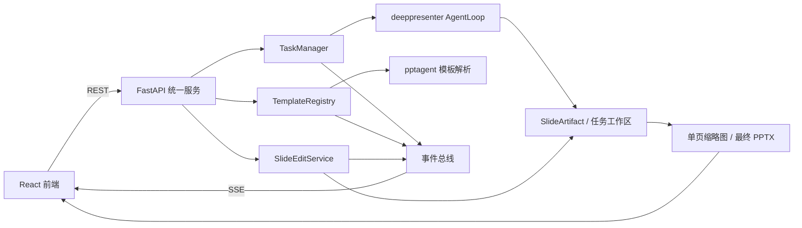

# PPTAgent 二次开发计划（两周 / 8 人）

仓库实际上有两套相关代码：

- `deeppresenter/`：当前主运行链路，负责 CLI、多 Agent 编排、研究、HTML 幻灯片生成和导出。
- `pptagent/`：旧版但仍在使用的模板解析、模板驱动生成和 MCP 服务。

本次不要同时大改两套架构。建议以 `deeppresenter` 作为任务入口和服务端主链路，复用 `pptagent` 已有的模板解析与模板式生成能力。新前端只调用统一的 FastAPI 接口，不直接理解两套内部实现。

### 2.2 当前可复用的部分

- `deeppresenter/main.py` 中的 `AgentLoop.run()` 已经是异步生成器，会持续产出 Agent 消息，适合加入结构化进度事件。
- `deeppresenter/agents/planner.py` 已支持生成前对大纲进行对话修改，可以复用其“生成器 + feedback”的思路。
- `deeppresenter/agents/env.py` 能统一观察每一次工具调用，适合在工具开始、完成、失败时上报事件。
- `deeppresenter/utils/webview.py` 和 `html2pptx/` 已有 HTML 预览、PDF/PPTX 转换基础。
- `pptagent/induct.py` 已有模板页面分类、布局聚类、内容 schema 抽取能力。
- `pptagent/scripts/template_induct.py` 已串起模板标准化、页面渲染、图片标注和 `slide_induction.json` 生成流程。
- `pptagent/mcp_server.py` 已有 `list_templates`、`set_template`、`create_slide`、`write_slide`、`generate_slide`、`save_generated_slides` 等工具。

### 2.3 当前需要补的关键能力

1. **模板不能动态上传和热加载**
   - 目前模板只从 `pptagent/templates/` 固定目录读取，且 MCP 服务启动时一次性加载。
   - `template_induct.py` 是离线批处理脚本，输入目录写死为 `data/*/pptx/*`，不能直接给前端调用。
   - `PPTGen.set_reference()` 会对传入的 `slide_induction` 执行 `pop()`，而服务端又缓存同一份字典；模板重复选择时有被前一次调用改坏的风险，应改为深拷贝或非破坏读取。

2. **现有“实时”只是原始日志流，不是产品化进度**
   - `webui.py` 会把 `ChatMessage` 和工具调用直接塞进聊天框，用户很难判断现在到了哪一步、还剩多少页。
   - 缺少统一的任务状态、事件序号、阶段进度、页级状态、取消和断线重连。

3. **没有生成中逐页预览**
   - 当前主流程通常只在最终拿到文件路径后提供下载。
   - 模板生成中的 `generate_slide()` 只返回“第几页成功”，没有持久化单页预览地址和结构化源数据。

4. **没有生成后的局部对话编辑模型**
   - 当前只能在生成前修改大纲；生成后的页面没有稳定 `slide_id`。
   - 页面内容、所用布局、元素 schema、生成命令和预览之间没有统一的可持久化记录。
   - 保存后模板 MCP 会清空内存状态，不适合继续围绕某一页多轮修改。

5. **前端不适合继续堆在 Gradio 上**
   - Gradio 适合演示，但三栏编辑器、页级状态、模板库、版本切换、局部聊天等交互会越来越难维护。
   - 建议保留 `webui.py` 作为旧演示入口，新增 React 前端作为二开主界面。

---

## 3. 四个开发方向与人员分配

8 人平均分成 4 个方向，每个方向固定 2 人。固定负责人能减少两周项目中的沟通损耗，但第 8～10 天允许互相支援联调。

| 方向 | 人员 | 主责 | 与其他方向的接口 |
|---|---:|---|---|
| A. 模板上传与解析 | 2 人：A1、A2 | 上传、校验、解析服务化、模板注册、缓存 | 向 C 提供解析事件；向 B 提供模板列表和缩略图；向 D 提供布局/schema |
| B. 新前端交互 | 2 人：B1、B2 | React 主界面、任务进度、逐页预览、局部聊天、版本交互 | 只依赖统一 API 和事件协议，不直接调用 Agent 内部代码 |
| C. 任务编排、实时进度与预览 | 2 人：C1、C2 | FastAPI、任务生命周期、SSE 事件、逐页预览、取消和恢复 | 包装 A、D 及现有 `AgentLoop`，是前后端主接口层 |
| D. 对话式局部编辑与版本管理 | 2 人：D1、D2 | 单页数据模型、对话修改、单页重生成、撤销、最终合并导出 | 复用 A 的模板数据，通过 C 发布编辑事件，由 B 提供交互入口 |

建议指定 C1 兼任后端接口负责人，B1 兼任前端接口负责人。每天只需 10～15 分钟同步一次接口变化，避免反复改字段。

---

## 4. 总体技术方案



### 4.1 为什么用 REST + SSE

两周内不必上复杂 WebSocket 协议：

- 创建任务、上传模板、发送修改指令、撤销、导出走 REST。
- 服务端到前端的进度、预览更新走 SSE。
- SSE 自带自动重连；事件带 `seq`，刷新页面后可以从最后事件继续接收。
- 本阶段服务端使用进程内 `asyncio.Queue`，事件同时追加写入任务目录的 `events.jsonl`，不引入 Redis/Celery。

如果后续要多实例部署，再把 `TaskManager` 和事件总线替换为 Redis/Celery，前端协议不需要改。

### 4.2 统一事件模型

建议新增 `GenerationEvent`：

```text
task_id       任务 ID
seq           单任务递增事件序号
type          事件类型
stage         template / plan / research / generate / edit / export
status        queued / running / succeeded / failed / cancelled
progress      0～100；无法精确计算时可为空
message       给用户看的简短说明
slide_id      与页面相关时填写
slide_index   当前页码
total_slides  总页数
artifact_url  新缩略图、PPTX 等产物地址
created_at    时间
payload       少量扩展数据
```

第一阶段只保留以下事件，避免协议过重：

- `task.created`、`task.started`、`task.completed`、`task.failed`、`task.cancelled`
- `template.parse_started`、`template.parse_progress`、`template.ready`、`template.failed`
- `stage.started`、`stage.progress`、`stage.completed`
- `slide.started`、`slide.preview_ready`、`slide.completed`、`slide.failed`
- `edit.started`、`edit.preview_ready`、`edit.applied`、`edit.failed`、`edit.reverted`
- `export.started`、`export.completed`、`export.failed`

不要把所有模型 token 或工具日志都发到主进度区。原始 Agent 消息可以放进“运行详情”折叠面板，产品进度只使用上述事件。

### 4.3 单页产物模型

每一页生成后立即保存为 `SlideArtifact`，而不是只存在于 Agent/MCP 内存：

```text
slide_id          稳定 UUID，页码变化时不变
task_id
index             当前排序
status
mode              html 或 template
layout_name       模板模式下使用
structured_data   标题、正文、图片等可编辑内容
source_path       HTML 或单页结构化源文件
preview_path      PNG/JPG 缩略图
revision          当前版本号
created_at / updated_at
```

工作区建议：

```text
workspace/<task_id>/
  task.json
  events.jsonl
  outline.json
  manuscript.md
  slides/
    <slide_id>/
      current.json
      revisions/
        1/slide.json
        1/preview.png
        2/slide.json
        2/preview.png
  exports/
    latest.pptx
```

生成与编辑的并发规则：

- 已完成页面可以在后续页面仍生成时修改。
- 同一页同时只允许一个生成/修改任务，使用 `asyncio.Lock` 做页级锁。
- 不同页面可以并行处理。
- 若用户对尚未完成的页面发出修改，先记录为待执行指令，页面完成后自动执行。
- 最终导出读取每页“最新成功版本”；失败中的草稿不能覆盖有效版本。

---

## 5. 方向 A：模板上传与解析（A1、A2，共 2 人）

### 目标

把现有离线模板解析脚本改造成可由 API 调用、能报告进度、能动态加载的服务。前端上传后无需重启 MCP 或服务，就能直接选择新模板生成。

### 代码重点

- 重构 `pptagent/scripts/template_induct.py`，将真实逻辑迁到可复用服务，脚本只保留 CLI 包装。
- 复用 `pptagent/induct.py::SlideInducter`，不重写聚类和 schema 抽取算法。
- 修改 `pptagent/mcp_server.py` 的固定模板目录和启动时缓存逻辑，引入动态 `TemplateRegistry`。
- 修复 `slide_induction` 被 `pop()` 破坏的问题：传入深拷贝，或把 `set_reference()` 改为非破坏读取。

### 任务拆分

| 工作 | 人数 | 负责人 | 建议时间 | 具体产出 |
|---|---:|---|---|---|
| 梳理现有解析链路，确定模板目录规范和 `TemplateManifest` | 2 | A1+A2 | 第 1 天 | 输入、输出、错误码、目录结构说明；一份真实模板跑通记录 |
| 模板上传、文件校验和安全命名 | 1 | A1 | 第 2～3 天 | `POST /api/templates` 所需 service；校验扩展名、ZIP/PPTX 可读性、文件大小、页数；防止路径穿越 |
| 把离线解析脚本重构为 `TemplateInductionService` | 1 | A2 | 第 2～4 天 | 支持 `parse(template_path, progress_callback)`；输出 `source.pptx`、页面图、`image_stats.json`、`slide_induction.json` |
| 模板缩略图、描述和 manifest 生成 | 1 | A1 | 第 4～5 天 | `manifest.json`，包含模板 ID、名称、比例、页数、布局数、主色、字体摘要、预览图 |
| 动态模板注册、列表、删除和热加载 | 1 | A2 | 第 4～6 天 | `TemplateRegistry`；新模板解析完成即可被 `set_template` 使用，不重启服务 |
| 解析进度、缓存、失败清理和重复上传去重 | 2 | A1+A2 | 第 6～7 天 | 通过文件 hash 复用解析结果；失败不进入可用模板列表；产生标准事件 |
| 与生成链路联调并补测试 | 2 | A1+A2 | 第 8～9 天 | 上传模板后成功生成至少 5 页；模板重复选择不报错；异常模板返回清晰错误 |

### 模板解析阶段建议

模板解析进度不要伪装成精确的模型耗时预测，只按确定步骤上报：

1. 文件校验 5%
2. `.ppt` 转换为 `.pptx`（如果需要）10%
3. 规范化并读取页面结构 20%
4. 渲染原始页和空布局页 35%
5. 布局分类/聚类 55%
6. 页面元素与内容 schema 抽取 80%
7. 生成缩略图、manifest 并注册 100%

### 格式范围

- P0：稳定支持 `.pptx`。
- P1：若系统存在 LibreOffice，则先把 `.ppt` 转为 `.pptx` 再走同一链路。
- `.ppt` 转换不可用时返回明确提示，不在两周内自研二进制 `.ppt` 解析器。

### 完成标准

- 上传一个未内置的 PPTX，解析完成后能在模板列表看到名称、缩略图和状态。
- 解析结果可被模板模式实际使用，不只是展示。
- 重复选择同一模板、连续生成两个任务不会因为缓存字典被修改而失败。
- 损坏文件、加密文件、空 PPT、超限文件均有可理解的错误提示。

---

## 6. 方向 B：新前端交互（B1、B2，共 2 人）

### 目标

使用 React + TypeScript + Vite 重写主界面。视觉上做成“轻量 AI 工作台”，重点不是堆动画，而是让用户清楚知道任务状态、当前页和修改结果。

建议技术栈：React、TypeScript、Vite、Tailwind CSS、Zustand；数据请求可直接使用 `fetch`，不必在两周内再引入较重框架。

### 核心页面

#### 1. 新建任务页

- 大输入框：PPT 主题/要求。
- 附件上传区。
- 模板选择：系统模板、用户模板、上传新模板。
- 页数、比例、语言等少量高级选项放在折叠区。
- “开始生成”后立刻进入编辑工作台。

#### 2. PPT 编辑工作台

采用三栏布局：

- 左侧：页面缩略图列表。每页显示等待、生成中、已完成、修改中、失败状态。
- 中间：大尺寸页面预览。预览上方显示页码和版本，可切换前后版本。
- 右侧：针对当前页的聊天区。预置快捷指令：“精简文字”“重新排版”“替换配色”“换一张图”“重新生成本页”。
- 顶部：总阶段进度、模板名称、取消任务、导出按钮。
- 底部或抽屉：运行详情，只放原始 Agent/工具日志，不占用主要区域。

#### 3. 模板库

- 展示模板缩略图、名称、解析状态、页数和布局数。
- 上传时展示解析阶段，而不是只有无限 loading。
- 解析失败可查看简短原因并重新上传。

### 关键交互细节

- 任务开始后先生成页面骨架，左侧能立即看到预计页数。
- 收到 `slide.preview_ready` 就替换对应 skeleton，不等待最终 PPT。
- 用户选中已完成页面即可聊天；尚未完成页面允许先输入指令，并提示“页面完成后自动执行”。
- 修改产生新预览后，显示“应用本版 / 保留当前版”；也可默认应用并提供撤销，最终选一种方式保持一致。
- SSE 断线时显示“正在重连”，使用最后 `seq` 补事件，不把任务误显示成失败。
- 页面生成失败时只在该页显示重试入口，其他页面继续。
- 导出过程中按钮进入明确状态；完成后展示最终文件和生成时间。

### 任务拆分

| 工作 | 人数 | 负责人 | 建议时间 | 具体产出 |
|---|---:|---|---|---|
| 信息架构、低保真交互和视觉 tokens | 2 | B1+B2 | 第 1 天 | 页面草图；颜色、字体、圆角、间距、状态色；确定三栏布局 |
| 初始化 React 工程和基础组件 | 1 | B1 | 第 2～3 天 | 路由、布局、按钮、上传、进度、提示、空状态、错误状态 |
| 新建任务页和模板库 | 1 | B2 | 第 2～4 天 | 模板上传、解析进度、模板选择、任务表单 |
| 编辑工作台和响应式布局 | 1 | B1 | 第 4～6 天 | 缩略图列表、中央预览、顶部进度、任务详情抽屉 |
| SSE 客户端、状态归并和断线重连 | 1 | B2 | 第 4～6 天 | 事件按 `seq` 去重；刷新后恢复；页级状态即时更新 |
| 当前页聊天、快捷指令、版本切换和撤销 | 2 | B1+B2 | 第 6～8 天 | 与局部编辑 API 对接；修改中/成功/失败交互完整 |
| 联调、视觉细节和异常状态收口 | 2 | B1+B2 | 第 9～10 天 | 常见屏幕尺寸可用；无明显跳动、空白、状态错乱 |

### 完成标准

- 用户不看日志也能知道当前处于什么阶段、正在生成第几页。
- 任意页面生成完成后 1～2 秒内能在左侧看到预览更新（不含页面本身的模型生成时间）。
- 当前页聊天的对象始终明确，不会把第 3 页指令发给第 4 页。
- 刷新页面后能恢复任务与已生成缩略图。
- 视觉风格统一，加载、空、失败、取消、完成状态都有明确反馈。

---

## 7. 方向 C：任务编排、实时进度与逐页预览（C1、C2，共 2 人）

### 目标

在现有 `AgentLoop` 外增加一层稳定的任务服务，把内部 Agent 消息变成前端可以理解的结构化事件，并在每一页完成时立刻生成缩略图。

### 代码重点

- 不把 API 路由直接写进 `webui.py`。
- 在 `deeppresenter/` 下新增服务层，例如：

```text
deeppresenter/server/
  app.py
  routes/tasks.py
  routes/templates.py
  routes/slides.py
  services/task_manager.py
  services/event_bus.py
  services/preview.py
  models/events.py
  models/artifacts.py
```

- 修改 `deeppresenter/main.py`，在 Planner、Research、Design/PPTAgent、Convert 各阶段显式发事件。
- 修改 `deeppresenter/agents/env.py`，增加可选事件回调，记录工具开始、结束和失败；不要由前端解析自然语言日志猜进度。
- 保持 `AgentLoop.run()` 对 CLI 的兼容，CLI 仍可忽略新增事件或只显示简化文本。

### 建议 API

| 方法 | 路径 | 用途 |
|---|---|---|
| `POST` | `/api/tasks` | 创建生成任务，返回 `task_id` |
| `GET` | `/api/tasks/{task_id}` | 获取当前快照 |
| `GET` | `/api/tasks/{task_id}/events` | SSE 订阅事件，支持最后 `seq` |
| `POST` | `/api/tasks/{task_id}/cancel` | 取消任务 |
| `POST` | `/api/tasks/{task_id}/retry` | 失败后重试当前阶段或失败页 |
| `GET` | `/api/tasks/{task_id}/slides` | 获取所有页及当前版本 |
| `GET` | `/api/tasks/{task_id}/artifacts/{path}` | 安全读取缩略图和导出文件 |
| `POST` | `/api/tasks/{task_id}/export` | 按最新页版本重新导出 |

### 进度计算

总进度用阶段权重即可，不需要制造虚假的精确剩余时间：

- 任务准备与附件处理：5%
- 大纲规划：10%
- 资料研究/稿件生成：25%
- 页面生成：50%，按完成页数均分
- 合并与导出：10%

若用户跳过 Planner，则将其权重合并到资料研究阶段。模板解析是独立任务，使用方向 A 的解析阶段进度。

### 逐页预览策略

- HTML 模式：当 `slide_*.html` 完成并通过检查后，调用现有 Playwright 能力渲染单页 PNG，保存到对应 `SlideArtifact`。
- 模板模式：`generate_slide()` 完成后立即持久化该 `SlidePage`，生成单页 PPTX/图片作为预览，再继续下一页。
- 缩略图生成失败不应把整页生成判定为失败；发出预览警告，最终 PPT 仍可继续。
- 预览地址带 revision 或内容 hash，避免浏览器缓存旧图。

### 任务拆分

| 工作 | 人数 | 负责人 | 建议时间 | 具体产出 |
|---|---:|---|---|---|
| 定义任务状态机、事件模型和接口契约 | 2 | C1+C2 | 第 1 天 | 与 A、B、D 评审后的 `GenerationEvent` 和 API 草案 |
| FastAPI 入口、任务创建/查询/取消 | 1 | C1 | 第 2～4 天 | `TaskManager` 包装 `asyncio.Task`；任务快照持久化 |
| 事件总线、SSE、事件序号和历史回放 | 1 | C2 | 第 2～4 天 | `events.jsonl`；断线重连；心跳；事件去重 |
| 给 `AgentLoop` 和 `AgentEnv` 增加事件钩子 | 2 | C1+C2 | 第 4～5 天 | 规划、研究、生成、导出均有阶段事件；失败信息统一 |
| 页级状态和 HTML/模板预览渲染 | 1 | C2 | 第 5～7 天 | 完成一页保存一页；发 `slide.preview_ready` |
| 任务恢复、失败页重试和取消检查点 | 1 | C1 | 第 6～8 天 | 服务重启后可读取已完成产物；取消不会留下“运行中”假状态 |
| 联调、压力和异常路径测试 | 2 | C1+C2 | 第 8～10 天 | 至少同时跑 2 个任务；SSE 断开、模型报错、预览失败均可解释 |

### 完成标准

- 任务状态只按合法路径变化，例如 `queued → running → completed/failed/cancelled`。
- 每个事件有递增 `seq`，重复连接不会造成前端重复页。
- 一页完成后立即形成独立产物和预览。
- 取消任务后不会继续启动新的页面生成；已完成页面仍保留。
- 单页失败不必导致所有其他页面丢失。

---

## 8. 方向 D：对话式局部编辑与版本管理（D1、D2，共 2 人）

### 目标

让用户选中一页后通过自然语言连续修改，系统只重做这一页，并保留最近版本。两周内以“页级修改 + 模板元素级内容修改”为主，不做任意框选像素区域的完整 PPT 编辑器。

### 修改范围分级

P0 必须完成：

- 修改标题、正文、要点、图片说明等内容。
- 对整页发出“更简洁、换布局、换配色、重新生成本页”等指令。
- 单页重生成后更新缩略图和最终 PPT。
- 撤销上一版，查看最近版本。

P1 有余力再做：

- 前端点选模板 schema 中的具体元素，如 `title`、`body_1`、`image_1`，把元素名和当前内容一起发给编辑服务。
- 两个版本的文字 diff 或并排预览。

本阶段不做：

- 在预览图上任意拖动文本框并精确写回 PPT 坐标。
- 多人同时编辑同一页。
- 对原生 PPT 中所有动画、SmartArt、宏进行无损编辑。

### 对话上下文

每次修改只给模型必要上下文：

- 当前页截图。
- 当前页 `structured_data`、布局名、元素 schema。
- 当前 PPT 的标题和大纲，用于保持全局一致。
- 当前页最近若干轮对话。
- 用户明确选中的元素（如果有）。

不要把整个任务历史、所有工具日志和完整 PPT 每次都塞给模型，避免成本和语义漂移。

### 两种生成模式的处理

#### 模板模式

- 保存 `layout_name`、`EditorOutput`/structured elements、模板 ID 和生成命令。
- 内容类修改优先重新执行 `write_slide → generate_slide`，只生成目标页。
- 布局类修改先重新选 layout，再生成目标页。
- 合并导出时按 `slide_id` 的当前 revision 重建页面顺序。

#### HTML 模式

- 保存每页 HTML 和相关资源路径。
- 修改时让 Design Agent 只读取目标页 HTML、截图和指令，输出新的目标页 HTML。
- 校验并渲染目标页预览；最终导出时重新转换整套最新 HTML。

### 版本策略

- 每次成功修改形成新 revision；失败草稿放临时目录，不提升 current revision。
- 每页默认保留最近 10 个 revision，超过后删除最旧预览，结构化日志可继续保留。
- “撤销”本质是把 current revision 指针切回上一成功版本，不重新请求模型。
- 导出时记录使用的每页 revision，方便复现。

### 建议 API

| 方法 | 路径 | 用途 |
|---|---|---|
| `POST` | `/api/tasks/{task_id}/slides/{slide_id}/chat` | 发送页级修改指令，可带 `element_id` |
| `GET` | `/api/tasks/{task_id}/slides/{slide_id}/revisions` | 获取版本列表 |
| `POST` | `/api/tasks/{task_id}/slides/{slide_id}/revisions/{revision}/apply` | 切换到指定版本 |
| `POST` | `/api/tasks/{task_id}/slides/{slide_id}/undo` | 撤销一次 |
| `POST` | `/api/tasks/{task_id}/slides/{slide_id}/retry` | 重试失败的修改 |

### 任务拆分

| 工作 | 人数 | 负责人 | 建议时间 | 具体产出 |
|---|---:|---|---|---|
| 定义 `SlideArtifact`、revision 和页级锁 | 2 | D1+D2 | 第 1～2 天 | 统一 JSON 模型和目录结构；与 C 的事件模型对齐 |
| 模板模式：持久化布局和结构化元素 | 1 | D1 | 第 3～5 天 | 页面保存后仍可独立重建；不依赖 MCP 临时内存 |
| HTML 模式：单页 HTML 修改和校验 | 1 | D2 | 第 3～5 天 | 只修改一个 HTML 文件；生成新预览；失败回滚 |
| `SlideEditService` 和页级对话上下文 | 2 | D1+D2 | 第 5～7 天 | 内容/布局/风格三类指令；发布 edit 事件 |
| revision、应用、撤销和最终合并 | 1 | D1 | 第 6～8 天 | 最近 10 版；current 指针；导出读取最新成功版 |
| 修改队列和生成中编辑 | 1 | D2 | 第 7～8 天 | 已完成页立即编辑；未完成页指令排队；同页串行 |
| 前后端联调和回归 | 2 | D1+D2 | 第 9～10 天 | 连续修改同一页 3 次、撤销、再导出，其他页面不变 |

### 完成标准

- 修改第 N 页时不会重新执行整套 Research 和所有页面生成。
- 修改失败时仍保留上一版可用页面。
- 连续两轮对话能理解“再短一点”是在上一版基础上继续改。
- 撤销不调用模型，响应快，并能正确影响最终导出。
- 编辑过程中其他页面可以继续生成，最终顺序和页数正确。

---

## 9. 两周节奏（10 个工作日）

以下是建议节奏，不需要卡死到小时。原则是第 5 天形成纵向最小链路，第 8 天停止增加 P1 功能，第 9～10 天只做联调、测试和演示收口。

| 日期 | A. 模板（2 人） | B. 前端（2 人） | C. 进度后端（2 人） | D. 局部编辑（2 人） | 当天共同结果 |
|---|---|---|---|---|---|
| 第 1 天 | 跑通已有模板解析，定 manifest | 画三栏工作台，定视觉 tokens | 定状态机、事件、API | 定 SlideArtifact/revision | 冻结第一版接口字段和目录结构 |
| 第 2 天 | 上传校验；解析服务拆分 | 初始化工程；基础布局 | FastAPI 和 TaskManager；SSE 骨架 | artifact 持久化和页级锁 | 前端能连 mock SSE，后端能发测试事件 |
| 第 3 天 | 跑通上传模板解析主流程 | 新建任务页、模板库 | 创建/查询/取消任务 | 保存模板/HTML 页的可编辑源数据 | 上传和任务创建的最小接口可用 |
| 第 4 天 | 缩略图、manifest、注册 | 工作台缩略图和中央预览 | AgentLoop 阶段事件 | 模板页/HTML 页单页重生成原型 | 能看到一个真实任务的阶段变化 |
| 第 5 天 | 动态模板热加载 | SSE 接真实进度 | 页级事件和第一种预览 | 第一种模式局部修改跑通 | **周中里程碑：上传模板 → 生成 → 一页预览 → 修改一页** |
| 第 6 天 | 去重、缓存、失败清理 | 当前页聊天、快捷指令 | 第二种模式预览；失败页状态 | 另一种模式局部修改；revision | 两种生成模式都能形成 SlideArtifact |
| 第 7 天 | PPT 兼容尝试、异常测试 | 版本切换、撤销、运行详情 | 恢复、重连、取消检查点 | 生成中编辑队列、同页串行 | 生成与编辑可并行，状态不冲突 |
| 第 8 天 | 与生成链路回归 | 完整串联、错误状态 | 重试、导出事件、并发任务 | 最终合并导出、失败回滚 | **功能冻结：P0 全部完成，停止扩需求** |
| 第 9 天 | 修模板边界问题 | 视觉和交互收口 | 集成测试、并发/断线测试 | 连续对话修改和导出回归 | 用统一测试模板跑完整演示脚本 |
| 第 10 天 | 文档、部署协助 | 演示页面和细节修复 | Docker/启动脚本、接口文档 | 局部编辑说明和已知限制 | 演示、测试报告、部署说明、代码合并 |

---

## 10. 每个人的主要工作边界

| 人员 | 主要负责 | 次要支援 |
|---|---|---|
| A1 | 上传接口、文件校验、manifest、缩略图、缓存 | 前端模板库接口联调 |
| A2 | 解析服务化、动态注册、MCP 模板加载、模板相关测试 | 模板模式局部重生成 |
| B1 | 前端架构、编辑工作台、视觉系统、中央预览 | 版本对比/撤销交互 |
| B2 | 新建任务、模板库、SSE 状态层、聊天区 | 断线重连和异常状态 |
| C1 | FastAPI、TaskManager、任务状态机、取消/恢复/导出 | Docker 和接口文档 |
| C2 | 事件总线、Agent 钩子、页级进度、预览渲染 | SSE 与前端联调 |
| D1 | 模板模式 SlideArtifact、结构化元素、revision、合并 | 模板解析数据衔接 |
| D2 | HTML 模式单页编辑、对话上下文、编辑队列 | 前端聊天协议联调 |

所有人都要给自己负责的模块补最小测试，不单独设“纯测试人员”。第 9～10 天由 A1、C1 牵头串完整测试清单。

---

## 11. 分支与协作方式

建议使用短分支，避免 4 条长期大分支最后一天才合并：

```text
main
├── feat/template-service
├── feat/frontend-workbench
├── feat/task-events
└── feat/slide-editing
```

协作约定：

- 第 1 天在仓库提交 `docs/api-contract.md` 和事件示例，接口字段变更必须同步该文件。
- 每个方向至少每天向集成分支合并一次可运行的小改动。
- 不直接大改另一方向文件；需要跨模块改动时，两位负责人一起 review。
- 事件和 API 使用 Pydantic/TypeScript 类型生成或手动保持一一对应，不靠口头约定。
- 每个 PR 说明“如何运行、如何验证、影响哪些接口”。
- 不把模型 key、用户上传文件和生成产物提交到 Git。

---

## 12. 测试重点

### 必测主链路

1. 上传 PPTX → 解析成功 → 模板列表出现。
2. 选择新模板 → 生成 5 页 → 每页逐步出现预览 → 导出成功。
3. 第 2 页生成完成后立即修改，同时第 3～5 页继续生成。
4. 对第 2 页连续说“缩短内容”→“再换成三点”→ 撤销一次 → 导出。
5. 刷新浏览器 → 恢复同一任务、页状态和缩略图。
6. SSE 中断后重连 → 不重复页面、不丢完成事件。
7. 取消任务 → 不再启动新页面，已完成页面仍能查看。

### 异常路径

- 上传损坏 PPTX、空 PPT、文件过大、加密文件。
- 模板解析中模型调用失败。
- 某一页生成失败但其他页成功。
- 单页预览失败但源页面有效。
- 同一页快速发送两条修改指令。
- 修改失败后撤销或继续导出。
- 服务重启后读取已完成任务。
- 两个用户同时创建任务，工作区和事件不串线。

### 最小自动化测试

- `TemplateRegistry` 注册、重复上传、失败清理。
- `GenerationEvent` 序列化、`seq` 递增和事件回放。
- Task 状态机非法跳转拦截。
- Slide revision 创建、应用、撤销、失败不覆盖 current。
- 最终导出使用最新成功 revision。
- API 的任务、模板、事件、局部编辑基本集成测试。

涉及模型和 LibreOffice/Playwright 的测试标记为 integration，日常单元测试使用固定 fixture 或 mock，避免每次都真实调用模型。

---

## 13. 两周验收清单

### P0：必须交付

- [ ] 自定义 PPTX 上传、解析、缓存、动态模板列表。
- [ ] 使用上传模板完成真实 PPT 生成。
- [ ] React 新前端，可创建任务和选择模板。
- [ ] 任务阶段进度、页级进度和逐页预览。
- [ ] 已完成页面可在全任务结束前开始修改。
- [ ] 针对单页的多轮对话修改。
- [ ] 单页 revision、撤销、失败回滚。
- [ ] 按各页最新版本导出完整 PPTX。
- [ ] 取消、刷新恢复、基础错误提示。
- [ ] Docker/本地启动说明、API 文档、测试记录。

### P1：有余力再做

- [ ] `.ppt` 自动转换。
- [ ] 点击具体元素后定向修改。
- [ ] 修改前后并排对比。
- [ ] 失败页一键重试。
- [ ] 模板主色/字体的更丰富可视化。

### 明确不进入本期

- [ ] 复杂账户、权限、计费系统。
- [ ] 多人同时在线编辑。
- [ ] 像 PowerPoint 一样自由拖拽所有元素。
- [ ] Redis/Celery/Kubernetes 等分布式改造。
- [ ] 重写整套 PPT 渲染内核。

---

## 14. 最终交付物

代码之外只保留必要文档，不要求写得形式化：

1. 可运行代码：后端、React 前端、模板解析和局部编辑。
2. `README`：一页以内写清启动、配置和演示方法。
3. `docs/api-contract.md`：接口和事件字段。
4. `docs/architecture.md`：两套原项目代码如何被新服务统一封装。
5. `docs/test-report.md`：主链路和已知问题。
6. `docs/deploy.md`：本地和 Docker 启动。
7. 2～3 个固定测试模板、一个完整演示任务和最终生成文件。

演示时按“上传模板 → 看解析进度 → 开始生成 → 逐页出现 → 选页聊天修改 → 撤销/重做 → 导出”这一条路径走即可，能清楚体现本次二开的核心价值。
